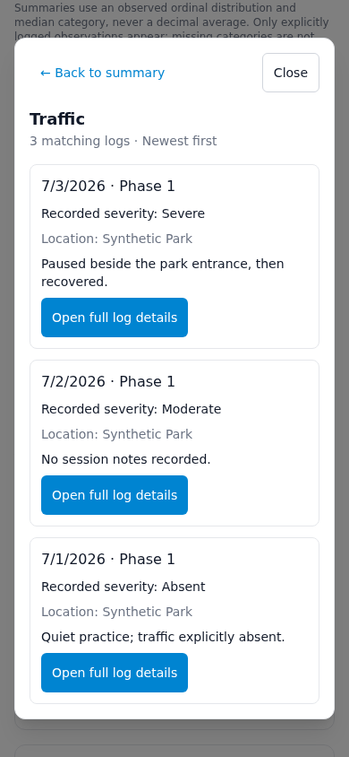
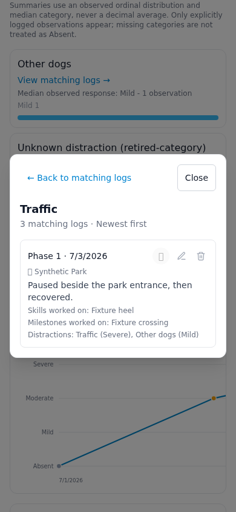

# Issue 71 — distraction source logs

Baseline fetched from main: `f05a30ff8425774e9432158a60e803fcf42873a5`.
Branch: `issue-71-distraction-logs`. Evidence collected October 4, 2026.

One tap opens the current dog's matching logs in a modal dialog. Results use
stored category IDs, include explicit Absent, deduplicate reports and sort by
sessionDate descending, then createdDate descending (the existing history order).
Missing category templates have an ID-bearing fallback label. Full details reuse
DogProfile's existing renderer, including its existing edit/delete/flag controls.
The source remains useReportsForDog; the shared pass-back overlay stays separate.
Ordinal summary calculations and the timeline remain intact.

The selected category and optional detail report are stored in page-local search
parameters so browser Back works through details, list and summary. No route,
store, API, schema, dependency or illustration changes are included.

## Verification

| Stage | Result |
| --- | --- |
| Node | 22.23.3 |
| npm ci | Passed |
| npm test | Passed, 64 tests |
| npm run lint | Passed; three existing warnings in App.tsx and GuideDogIllustration.tsx |
| npm run build | Passed with CI's production API URL |
| npm --prefix worker ci | Passed |
| npm --prefix worker run typecheck | Passed |
| git diff --check | Passed |
| Chromium synthetic browser checks | Passed |
| Remaining failed stages | None |
| Blocked stages | None |

See [verification.json](verification.json), the adjacent command logs, and
[browser-results.json](browser-results.json). The production build was compiled
with `VITE_API_BASE_URL=https://abbys-dog-chej-api.otmooper12.workers.dev`; browser
verification used a separate Vite dev server configured for a loopback fixture API.
No production API was contacted and no records were written.

The browser script tests 390px and 320px widths, one-tap opening, category/count,
newest-session-first ordering, severity/Absent, notes/context, full details,
visible Back, browser Back, Close, Escape, repeated/different categories, empty
results, retired labels, client-side dog navigation and a stale cross-dog detail
URL. It asserts zero browser errors, API writes and external requests. Unit tests
add exact-ID/dog isolation, duplicate prevention and creation-date tie-breaking.

The initial Playwright browser download was corrupt. An external test-only
Chromium 153 binary supplied by @sparticuz/chromium recovered browser testing;
repository dependencies were not changed. Early harness runs also exposed
asynchronous assertion timing; the retained script waits for the rendered state.
No unresolved application failures remain from these checks. Phone verification
is Chromium touch/viewport emulation, not a physical iOS device test.

## Reproduce browser checks

Use Node 22, run `npm ci`, and start the isolated frontend:

```sh
VITE_API_BASE_URL=http://127.0.0.1:4174 npm run dev -- --host 127.0.0.1 --port 4173
```

With Playwright installed externally, run in a second terminal:

```sh
NODE_PATH=/path/to/test-tools/node_modules node tests/distractionLogs.browser.cjs
```

Optionally set `TEST_CHROMIUM_PATH` to an existing Chromium executable. The script
intercepts the loopback API with synthetic fixtures and rejects external requests
and API writes. There is no real account or backend setup. In environments with
per-command network isolation, start Vite and the browser script in the same shell.

## Screenshots

[Phone summary](phone-summary.png) · [Matching logs](phone-matching-logs.png) ·
[Full details](phone-log-details.png) · [Empty state](phone-empty-state.png) ·
[Desktop list](desktop-matching-logs.png)




